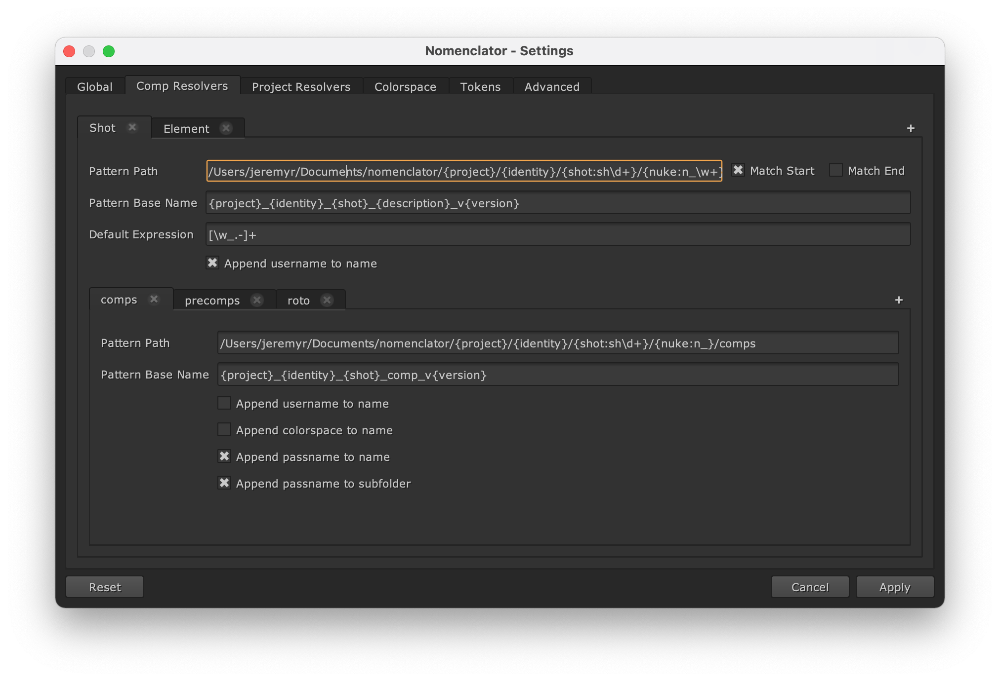

.. _configuration:

*************
Configuration
*************

A :term:`Toml` configuration is used to define templates and default options.

The configuration file must be named :file:`nomenclator.toml`. It is located in
:file:`~/.nuke` or by using the :envvar:`NOMENCLATOR_CONFIG_PATH` environment variable.

The configuration can be edited via the Settings dialog:

.. _configuration/global:

Global
======

Global configuration options include the following:

.. _configuration/global/default-padding:

default-padding
---------------

Define default value for the ``{padding}`` token.

.. code-block:: toml

    default-padding = "###"

.. note::

    The default padding will be 1. It will use the Hash notation (#)
    or the printf notation (%01d) following the preferences.

.. _configuration/global/default-description:

default-description
-------------------

Define default value for the ``{description}`` token.

.. code-block:: toml

    default-description = "comp"

.. note::

    The default description will be the first item of the :ref:`descriptions
    <configuration/global/descriptions>` list.

.. _configuration/global/descriptions:

descriptions
------------

Define all available values for the ``{description}`` token.

.. code-block:: toml

    descriptions = ["desc1", "desc2", "desc3"]

.. note::

    The default descriptions are "comp", "precomp", "roto" and "cleanup".

.. _configuration/global/create-subfolders:

create-subfolders
-----------------

Define whether sub-folders defined for render outputs must be created
when a naming convention is applied.

.. code-block:: toml

    create-subfolders = true

.. note::

    By default, sub-folders are not created when a naming
    convention is applied.

.. _configuration/global/comp-templates:

comp-templates
--------------

Define the :ref:`template configurations <configuration/template>` available
to define the naming convention of a composition scene file (.nk) and associated
render outputs.

.. code-block:: toml

    [[comp-templates]]
    id = "Episodic"
    pattern-path = "/path/{project}/{episode:ep\\d+}/{shot:sh\\d+}/scripts"
    pattern-base = "{project}_{episode}_{shot}_{description}_v{version}"

    [[comp-templates.outputs]]
    id = "comps"
    pattern-path = "/path/{project}/{episode:ep\\d+}/{shot:sh\\d+}/comps"
    pattern-base = "{project}_{episode}_{shot}_comp_v{version}"

    [[comp-templates.outputs]]
    id = "precomps"
    pattern-path = "/path/{project}/{episode:ep\\d+}/{shot:sh\\d+}/precomps"
    pattern-base = "{project}_{episode}_{shot}_precomp_v{version}"

.. note::

    By default, no composition templates are set.

.. _configuration/global/project-templates:

project-templates
-----------------

Define the :ref:`template configurations <configuration/template>` available
to define the naming convention of a project file (.hrox).

.. code-block:: toml

    [[project-templates]]
    id = "Conform"
    pattern-path = "/path/{project}/edit/hiero"
    pattern-base = "{project}_{description}_v{version}"

.. note::

    By default, no project templates are set.

.. _configuration/global/colorspace-aliases:

colorspace-aliases
------------------

Define all aliased to use for colorspace values returned by Nuke to
resolve the ``{colorspace}`` token.

.. code-block:: toml

    [colorspace-aliases]
    "Gamma1.8" = "gamma18"
    linear = "lin"
    sRGB = "srgb"

.. note::

    By default, the "lin" alias is defined for the "linear" value and
    the "srgb" alias is defined for the "sRGB" value.

.. _configuration/global/tokens:

tokens
------

Define any additional token values that could be found in templates.

.. code-block:: toml

    [tokens]
    foo = "bar"

.. note::

    If the token ``{foo}`` is found in any templates, it will be replaced
    by "bar" following this example. An error will be raised if no value is
    defined.

.. _configuration/global/max-locations:

max-locations
-------------

Define the maximum number of recent locations to display in the comp
and project management dialog.

.. code-block:: toml

    max-locations = 10

.. note::

    By default, only 5 recent locations will be displayed.

.. seealso::

    * :func:`nomenclator.utilities.fetch_recent_comp_paths`
    * :func:`nomenclator.utilities.fetch_recent_project_paths`

.. _configuration/global/max-padding:

max-padding
-----------

Define the maximum available value of padding for image sequences. It will
adjust the list of padding available in the comp and output management
dialogs.

.. code-block:: toml

    max-padding = 10

.. note::

    By default, the maximum value of padding is 5.

.. seealso::

    :func:`nomenclator.utilities.fetch_paddings`

.. _configuration/global/username:

username
--------

Define the value for the ``{username}`` token.

.. code-block:: toml

    username = "steve"

.. note::

    The default username will be the value returned by
    :func:`getpass.getuser`.

.. _configuration/template:

Template
========

A template configuration is a subset of the configuration which
define the naming convention for a composition scene file and its outputs
or for a project file.

The list of template configurations can be defined via the "Comp Resolvers"
and "Project Resolvers" tabs of the Settings dialog:

.. _configuration/template/pattern-path:

pattern-path
------------

Define the pattern of a location path compatible with the
naming convention.

It can be defined without any tokens:

.. code-block:: toml

    pattern-path = "/path/scripts"

If tokens are defined, the matching values will be extracted to be reused
in the :ref:`configuration/template/pattern-base` option:

.. code-block:: toml

    pattern-path = "/path/{project}/{episode}/{shot}/scripts"

.. note::

    By default the regular expression used to search the token is ``[\w_.-]+``.
    You can :ref:`modify the default expression
    <configuration/template/default-expression>` or define custom
    expressions per token:

    .. code-block:: toml

        pattern-path = "/path/{project}/{episode:ep\\d+}/{shot:sh\\d+}/scripts"

.. _configuration/template/pattern-base:

pattern-base
------------

Define the naming convention of the base of a scene file name (without
additional elements and extension).

It can be defined without any tokens:

.. code-block:: toml

    pattern-base = "foo"

It can also be defined with tokens which will be dynamically resolved:

.. code-block:: toml

    pattern-base = "{project}_{episode}_{shot}_{description}_v{version}"

Tokens which can be used are

* Default tokens (``{description}``, ``{username}``, ``{version}``)
* Tokens extracted from the corresponding :ref:`configuration/template/pattern-path`
* Tokens defined in the :ref:`configuration/global/tokens` option.

.. warning::

    If a token can not be resolved, an error will be raised.

.. _configuration/template/default-expression:

default-expression
------------------

Define a custom expression to fetch token values.

.. code-block:: toml

    default-expression = "\\w+"

.. note::

    By default the regular expression used to search the token
    is ``[\w_.-]+``.

.. _configuration/template/match-start:

match-start
-----------

Define whether compatible paths must match exactly the start of the
corresponding :ref:`configuration/template/pattern-path` value.

.. code-block:: toml

    match-start = false

If this value is set to false, it is possible to define a flexible
root folder for scene files where the naming convention will be applied.

.. note::

    By default, this value is set to true.

.. _configuration/template/match-end:

match-end
---------

Define whether compatible paths must match exactly the end of the
corresponding :ref:`configuration/template/pattern-path` value.

.. code-block:: toml

    match-end = false

If this value is set to false, it is possible to define flexible
subfolders for scene files where the naming convention will be applied.

.. note::

    By default, this value is set to true.

.. _configuration/template/append-username-to-name:

append-username-to-name
-----------------------

Define whether the username should be appended to the scene file by
default.

.. code-block:: toml

    append-username-to-name = true

This feature is only available when the comp manager dialog or the project
manager dialog is opened and the current file name is matching the template.

.. note::

    By default, this value is set to false.

.. _configuration/template/outputs:

outputs
-------

Define the :ref:`output template configurations <configuration/output_template>`
available to define the naming convention of render outputs.

.. code-block:: toml

    [[comp-templates.outputs]]
    id = "comps"
    pattern-path = "/path/{project}/{episode:ep\\d+}/{shot:sh\\d+}/comps"
    pattern-base = "{project}_{episode}_{shot}_comp_v{version}"

    [[comp-templates.outputs]]
    id = "precomps"
    pattern-path = "/path/{project}/{episode:ep\\d+}/{shot:sh\\d+}/precomps"
    pattern-base = "{project}_{episode}_{shot}_precomp_v{version}"

.. note::

    By default, no render output templates are set.

.. warning::

    No render outputs can be set for project files (.hrox).

.. _configuration/output_template:

Output Template
===============

An output template configuration is a subset of a :ref:`configuration/template`
which define the naming convention for a render output video or image sequence.

.. _configuration/output_template/id:

id
--

Define the identifier of the output destination. It will be displayed
in the destination selector within the comp manager dialog.

.. code-block:: toml

    id = "comps"

.. _configuration/output_template/pattern-path:

pattern-path
------------

Like the :ref:`configuration/template/pattern-path` option used for the
scene files, this option define the pattern of an output location path
compatible with the naming convention.

.. code-block:: toml

    pattern-path = "/path/{project}/{episode:ep\\d+}/{shot:sh\\d+}/comps"

.. _configuration/output_template/pattern-base:

pattern-base
------------

Like the :ref:`configuration/template/pattern-base` option used for the
scene files, this option define the naming convention of the base of
a render output.

.. code-block:: toml

    pattern-base = "{project}_{episode}_{shot}_comp_v{version}"

.. _configuration/output_template/append-username-to-name:

append-username-to-name
-----------------------

Define whether the username should be appended to the render output file by
default.

.. code-block:: toml

    append-username-to-name = true

This feature is only available when the comp manager dialog is opened and
the current output file name is matching the template.

.. note::

    By default, this value is set to false.

.. _configuration/output_template/append-colorspace-to-name:

append-colorspace-to-name
-------------------------

Define whether the colorspace should be appended to the render output file by
default.

.. code-block:: toml

    append-colorspace-to-name = true

This feature is only available when the comp manager dialog is opened and
the current output file name is matching the template.

.. note::

    By default, this value is set to false.

.. _configuration/output_template/append-passname-to-name:

append-passname-to-name
-----------------------

Define whether the passname should be appended to the render output file by
default.

.. code-block:: toml

    append-passname-to-name = true

This feature is only available when the comp manager dialog is opened and
the current output file name is matching the template.

.. note::

    By default, this value is set to false.

.. _configuration/output_template/append-passname-to-subfolder:

append-passname-to-subfolder
----------------------------

Define whether the passname should be appended to the render output
subfolder by default.

.. code-block:: toml

    append-passname-to-subfolder = true

This feature is only available when the comp manager dialog is opened and
the current output file name is matching the template.

.. note::

    This option is ignored if the corresponding
    :ref:`configuration/output_template/pattern-base` value does not
    define a subfolder.

.. note::

    By default, this value is set to false.
