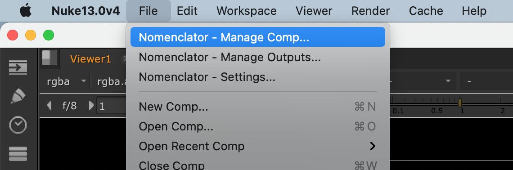
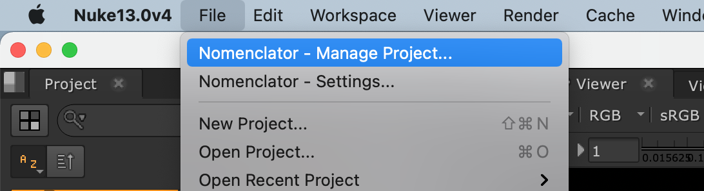

.. _installing:

**********
Installing
**********

.. highlight:: bash

The Nomenclator plugin can be installed for :term:`Nuke`, :term:`Nuke Studio`
and :term:`Hiero`.

.. _installing/nuke:

Installing for Nuke
====================

Copy the Python module :file:`./source/nomenclator` into your personal :file:`~/.nuke` folder
(or update your :envvar:`NUKE_PATH` environment variable) and add the following
`menu.py` file:

.. include:: ../resource/nuke-menu.py
   :code: python

This is how the menu should look like within :term:`Nuke`:

.. note::

    Download the :download:`starter script <../resource/nuke-menu.py>`

.. _installing/hiero:

Installing for Hiero / Studio
=============================

Copy the Python module :file:`./source/nomenclator` into a :file:`~/.nuke/Python/StartupUI` folder
(or update your :envvar:`HIERO_PLUGIN_PATH` environment variable) and add the following
`menu.py` file:

.. include:: ../resource/hiero-menu.py
   :code: python

This is how the menu should look like within :term:`Hiero` or :term:`Nuke Studio`:

.. note::

    Download the :download:`starter script <../resource/hiero-menu.py>`

.. _installing/source:

Installing from source
======================

You can also install manually from the source for more control. First obtain a
copy of the source by either downloading the `zipball
<https://github.com/buddly27/nomenclator-nuke/archive/main.zip>`_
or cloning the public repository::

    git clone git@github.com:buddly27/nomenclator-nuke.git

.. note::

    Using :term:`Virtualenv` is recommended when evaluating or running locally.

Then you can build and install the package into your current Python
environment::

    pip install .

If actively developing, you can perform an editable install that will link to
the project source and reflect any local changes made instantly::

    pip install -e .

You can then install the starter scripts for :term:`Nuke` and :term:`Hiero` as referred
in the two previous sections to use it.

.. note::

    If you plan on building documentation and running tests, run the following
    command instead to install required extra packages for development::

        pip install -e ".[dev]"

.. _installing/source/doc:

Building documentation from source
----------------------------------

Ensure you have installed the 'extra' packages required for building the
documentation::

    pip install -e ".[doc]"

Then you can build the documentation with the command::

    python setup.py build_sphinx

View the result in your browser at::

    file:///path/to/nomenclator-nuke/build/doc/html/index.html

.. _installing/source/test:

Running tests against the source
--------------------------------

Ensure you have installed the 'extra' packages required for running the tests::

    pip install -e ".[test]"

Then run the tests as follows::

    python setup.py -q test

You can also generate a coverage report when running tests::

    python setup.py -q test --addopts "--cov --cov-report=html"

View the generated report at::

    file:///path/to/nomenclator-nuke/htmlcov/index.html

.. _installing/external:

Managing External dependencies
==============================

The Nomenclator plugin rely on two external dependencies:

* `toml <https://pypi.org/project/toml/>`_ to read :term:`Toml` configuration files.
* `Qt.py <https://pypi.org/project/Qt.py/>`_ to preserve compatibility between
  :term:`PySide` (used in Nuke 11 and earlier) and :term:`PySide2` (used in Nuke 12 and later).

For convenience, specific versions of these libraries are embedded in the plugin using
the `vendoring <https://pypi.org/project/vendoring/>`_ CLI tool. These versions are defined in
the :file:`source/nomenclator/vendor/vendor.txt` file:

.. include:: ../source/nomenclator/vendor/vendor.txt
   :code: ini

To update the versions, modify this file and run the following command::

    vendoring update .
