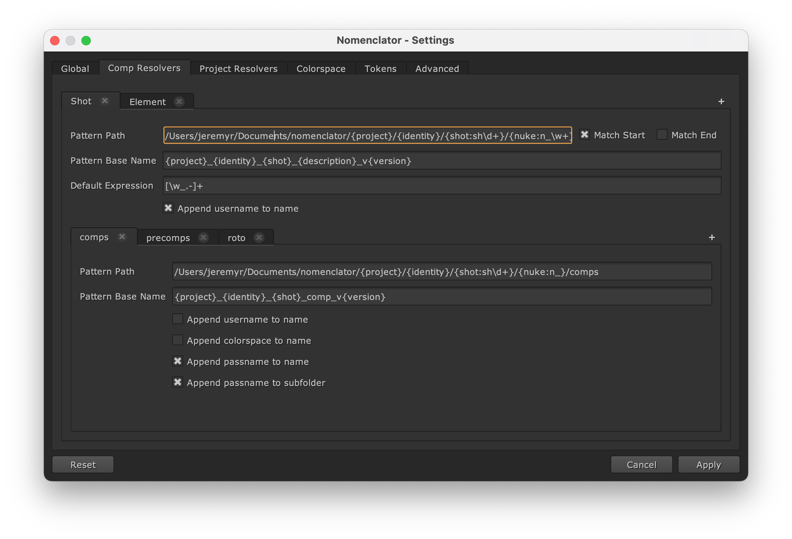

.. _template_configuration:

**********************
Template Configuration
**********************

A template configuration is a subset of the :ref:`configuration` which
define the naming convention for a composition scene file and its outputs
or for a project file.

The list of template configurations can be defined via the "Comp Resolvers"
and "Project Resolvers" tabs of the Settings dialog:

.. _template_configuration/pattern-path:

pattern-path
============

Define the pattern of a location path compatible with the
naming convention.

It can be defined without any tokens:

.. code-block:: toml

    pattern-path = "/path/scripts"

If tokens are defined, the matching values will be extracted to be reused
in the :ref:`template_configuration/pattern-base` option:

.. code-block:: toml

    pattern-path = "/path/{project}/{episode}/{shot}/scripts"

.. note::

    By default the regular expression used to search the token is ``[\w_.-]+``.
    You can :ref:`modify the default expression
    <template_configuration/default-expression>` or define custom
    expressions per token:

    .. code-block:: toml

        pattern-path = "/path/{project}/{episode:ep\\d+}/{shot:sh\\d+}/scripts"

.. _template_configuration/pattern-base:

pattern-base
============

Define the naming convention of the base of a scene file name (without
additional elements and extension).

It can be defined without any tokens:

.. code-block:: toml

    pattern-base = "foo"

It can also be defined with tokens which will be dynamically resolved:

.. code-block:: toml

    pattern-base = "{project}_{episode}_{shot}_{description}_v{version}"

Tokens which can be used are

* Default tokens (``{description}``, ``{username}``, ``{version}``)
* Tokens extracted from the corresponding :ref:`template_configuration/pattern-path`
* Tokens defined in the :ref:`configuration/tokens` option.

.. warning::

    If a token can not be resolved, an error will be raised.

.. _template_configuration/default-expression:

default-expression
==================

Define a custom expression to fetch token values.

.. code-block:: toml

    default-expression = "\\w+"

.. note::

    By default the regular expression used to search the token
    is ``[\w_.-]+``.

.. _template_configuration/match-start:

match-start
===========

Define whether compatible paths must match exactly the start of the
corresponding :ref:`template_configuration/pattern-path` value.

.. code-block:: toml

    match-start = false

If this value is set to false, it is possible to define a flexible
root folder for scene files where the naming convention will be applied.

.. note::

    By default, this value is set to true.

.. _template_configuration/match-end:

match-end
=========

Define whether compatible paths must match exactly the end of the
corresponding :ref:`template_configuration/pattern-path` value.

.. code-block:: toml

    match-end = false

If this value is set to false, it is possible to define flexible
subfolders for scene files where the naming convention will be applied.

.. note::

    By default, this value is set to true.

.. _template_configuration/append-username-to-name:

append-username-to-name
=======================

Define whether the username should be appended to the scene file by
default.

.. code-block:: toml

    append-username-to-name = true

This feature is only available when the comp manager dialog or the project
manager dialog is opened and the current file name is matching the template.

.. note::

    By default, this value is set to false.

.. _template_configuration/outputs:

outputs
=======

Define the :ref:`output template configurations <output_template_configuration>`
available to define the naming convention of render outputs.

.. code-block:: toml

    [[comp-templates.outputs]]
    id = "comps"
    pattern-path = "/path/{project}/{episode:ep\\d+}/{shot:sh\\d+}/comps"
    pattern-base = "{project}_{episode}_{shot}_comp_v{version}"

    [[comp-templates.outputs]]
    id = "precomps"
    pattern-path = "/path/{project}/{episode:ep\\d+}/{shot:sh\\d+}/precomps"
    pattern-base = "{project}_{episode}_{shot}_precomp_v{version}"

.. note::

    By default, no render output templates are set.

.. warning::

    No render outputs can be set for project files (.hrox).
