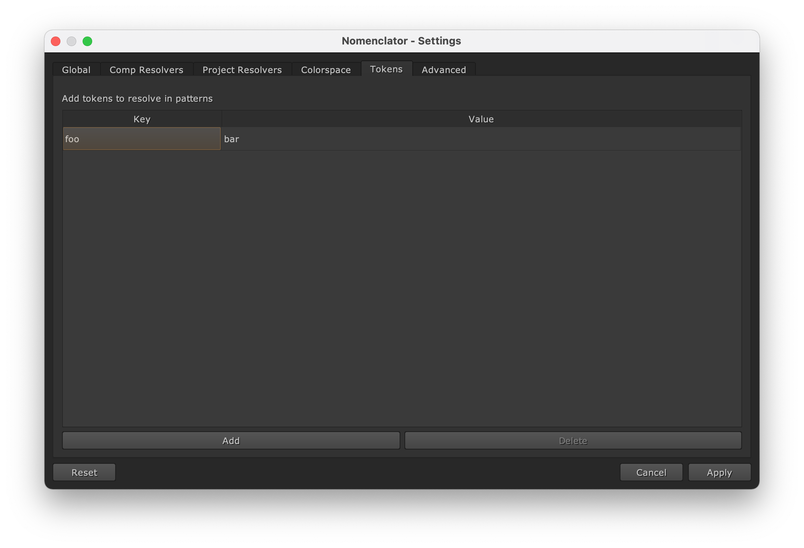

.. _token:

************
Using Tokens
************

A Token is an element of a :ref:`template pattern base name
<configuration/template/pattern-base>` which will be replaced by a resolved value
during the naming process. It is an alpha-numerical name contained in curly-braces.

Let's consider the following pattern::

    "{project}_{episode}_{shot}_{description}_v{version}"

The tokens used are ``project``, ``episode``, ``shot``, ``description`` and ``version``.

There are three types of tokens.

.. _token/extracted:

Extracted Tokens
================

These are tokens which are defined in the :ref:`template pattern path
<configuration/template/pattern-path>`. For instance::

    "/path/{project}/{episode:ep\d+}/{shot:sh\d+}/scripts"

A matching path should provide resolved values for the ``project``, ``episode`` and
``shot`` tokens.

.. note::

    Custom expressions are defined for the ``episode`` and ``shot`` tokens. It means that
    the matching episode folder must be in the form of "ep001" and the matching shot folder
    must be in the form of "sh001".

    The ``project`` token does not define any custom expression, therefore the corresponding
    folder must match the :ref:`configuration/template/default-expression`.

A matching path could be::

    /path/my_project/ep002/sh004/scripts

This will generate the following tokens:

==========  ==============
Token Name  Resolved Value
==========  ==============
project     my_project
episode     ep002
shot        sh004
==========  ==============

.. _token/default:

Default Tokens
==============

These are tokens which are automatically defined by the plugin:

.. _token/default/description:

description
-----------

The value for the ``description`` token will be provided by the comp manager
dialog. The default value is initiated with the :ref:`configuration/global/default-description`
configuration option.

.. _token/default/version:

version
-------

The value for the ``version`` token will be deduced by comparing the targeted
:ref:`template pattern base name <configuration/template/pattern-base>` with
other files in the destination folder.

If the comp manager dialog is opened, the resolved value will be the next version
that must be saved in the destination folder. If the output manager dialog is opened, the
resolved value will be the latest version retrieved from the destination folder.

.. _token/default/username:

username
--------

The value for the ``username`` token will be provided by the :func:`getpass.getuser`
function or the :ref:`configuration/global/username` configuration option.

.. _token/default/colorspace:

colorspace
----------

The value for the ``colorspace`` token will be provided by the colorspace :func:`knob value
<nomenclator.utilities.fetch_colorspace>` of an output node. It could be adjusted by
defining an alias with the :ref:`configuration/global/colorspace-aliases` configuration option.

.. note::

    This token should be used for render output names only.

.. _token/default/passname:

passname
--------

The value for the ``passname`` token will be provided by the comp manager dialog or the
output manager dialog. The default value is initiated with the output node name.

.. note::

    This token should be used for render output names only.

.. _token/default/padding:

padding
-------

The value for the ``padding`` token will be provided by the comp manager dialog or the
output manager dialog. The default value is initiated with the
:ref:`configuration/global/default-padding` configuration option.

.. note::

    This token should usually not be used directly. It will be automatically appended to
    render output sequences.

.. _token/custom:

Custom Tokens
=============

These are additional tokens that can be defined with the
:ref:`configuration/global/tokens` configuration option.

You can add new tokens via the settings dialog:

