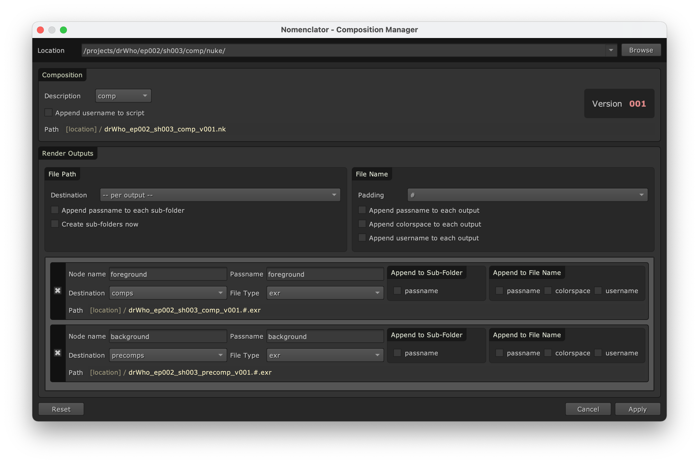

.. _tutorial:

********
Tutorial
********

In this tutorial, we will be configuring the naming convention templates for an episodic
program.

Your team is working on the next season of `Dr Who <https://en.wikipedia.org/wiki/Doctor_Who>`_,
and you are working within the following folder structure::

    /projects/
     |- drWho
         |- build
         |- conform
         |   |- hiero
         |- ep001
             |- sh001
                 |- comp
                     |- nuke
                     |- comps
                     |- precomps

The :term:`Compositing` tasks are broken down in episodes and shots. For each shot,
the :term:`Nuke` scene files must be saved into the :file:`comp/nuke` folders.
For instance::

    /projects/drWho/ep001/sh001/comp/nuke

There is one :term:`Conforming` task for the entire project. Therefore, the :term:`Hiero`
project files must be saved at the project level, within the :file:`conform/hiero`
folder::

    /projects/drWho/conform/hiero

Instead of hard-coding the project name, we would like to define a naming convention which could
easily be adapted to a new project which would adopt a similar structure.

.. _tutorial/comp_template:

Defining a comp template
------------------------

Let's create a :ref:`template <configuration/template>` to define the naming
convention for the :term:`Compositing` tasks.

Open the Setting Dialog and click on the "Comp Resolvers" tab to create the template.

Click on the "+" button on the top-right corner to add a new template which
is automatically named "Comp1".

.. note::

    You can edit the name by double clicking on the "Comp1" tab. You would
    then be able to type a new name and click enter to apply it. We will
    keep the automatic "Comp1" name in this tutorial.

We want the :term:`Nuke` composition scene files to be named in the form of::

    drWho_ep001_sh001_comp_v001.nk

Therefore, the :ref:`configuration/template/pattern-base` value should be::

    {project}_{episode}_{shot}_{description}_v{version}

The ``project``, ``episode`` and ``shot`` tokens should be :ref:`extracted <token/extracted>` from
the folder structure. For instance, let's consider the following location::

    /projects/drWho/ep001/sh001/comp/nuke

The resolved tokens should be:

==========  ==============
Token Name  Resolved Value
==========  ==============
project     drWho
episode     ep001
shot        sh001
==========  ==============

Therefore, the :ref:`configuration/template/pattern-path` value should be::

    /projects/{project}/{episode}/{shot}/comp/nuke

To prevent any matching error, we can be even more specific and define
custom regular expression for the ``episode`` and ``shot`` tokens::

    /projects/{project}/{episode:ep\d+}/{shot:sh\d+}/comp/nuke

.. note::

    We can uncheck the :ref:`configuration/template/match-end` box so that the
    naming convention can be applied to scenes saved in sub-folders, for
    instance::

        /projects/drWho/ep001/sh001/2D/nuke/sub-1/sub-2

This is how the settings dialog should look like:

.. image:: ./image/comp-resolver-2.png
    :alt: Comp Resolver with one template

Defining output templates
-------------------------

Let's now create two :ref:`output templates <configuration/output_template>` to define the naming
convention for the render outputs for the comp template previously created:

* Default renders should be saved in the :file:`comp/comps` folder and be
  named in the form of::

    drWho_ep001_sh001_comp_v001/drWho_ep001_sh001_comp_v001.%03d.exr

* Precomps renders should be saved in the :file:`comp/precomps` folder and be
  named in the form of::

    drWho_ep001_sh001_precomp_v001/drWho_ep001_sh001_precomp_v001.%03d.exr

Note that we also want to create subfolders for each outputs to better organize the image
sequences.

Click twice on the "+" button located on the top-right corner of the frame below
the composition template filled up in the previous section to add a two new
output templates which will be automatically named "Output1" and "Output2".

Double click on the tab labels to rename them "comps" and "precomps".

The :ref:`configuration/output_template/pattern-base` values for "comps" and "precomps"
should be respectively::

    {project}_{episode}_{shot}_comp_v{version}/{project}_{episode}_{shot}_comp_v{version}
    {project}_{episode}_{shot}_precomp_v{version}/{project}_{episode}_{shot}_precomp_v{version}

.. note::

    We could also have used a single convention for both outputs by using the
    :ref:`token/default/description` token::

        {project}_{episode}_{shot}_{description}_v{version}/{project}_{episode}_{shot}_{description}_v{version}

The :ref:`configuration/output_template/pattern-path` values for "comps" and "precomps"
should be respectively::

    /projects/{project}/{episode:ep\d+}/{shot:sh\d+}/comp/comps
    /projects/{project}/{episode:ep\d+}/{shot:sh\d+}/comp/precomps

.. warning::

    New tokens are currently not :ref:`extracted <token/extracted>` from the
    :ref:`configuration/output_template/pattern-path` of output templates.

We will also check the :ref:`configuration/output_template/append-passname-to-name` and
:ref:`configuration/output_template/append-passname-to-subfolder` boxes for "comps" so that we
can automatically add the :ref:`token/default/passname` token to the subfolder and the base name.

This is how the settings dialog should look like:

.. image:: ./image/comp-resolver-3.png
    :alt: Comp Resolver with two output templates

Saving the configuration
------------------------

Apply to automatically save the new configuration into :file:`~/.nuke/nomenclator.toml`.

.. note::

    You could save the configuration into another location by using the
    :envvar:`NOMENCLATOR_CONFIG_PATH` environment variable.

This is how the configuration saved should look like:

.. include:: ../resource/configuration-example.toml
    :code: toml

.. note::

    You can directly edit the :term:`TOML` configuration and send it to
    a team member to share it.

Managing the composition
------------------------

Now you can open a new :term:`Nuke` script and create two Write nodes.

.. image:: ./image/unsaved-comp.png
    :alt: Unsaved Comp

Open the Comp Manager Dialog and browse to::

    /projects/my_project/ep002/sh003/2D/scripts/

You can see that the names are automatically generated following the naming conventions
defined in the previous sections.

Change the destination of the "Write2" node to "precomps" and save the
script by clicking on "Apply". You can now see that the name files have been
updated:

.. image:: ./image/saved-comp.png
    :alt: Saved Comp

