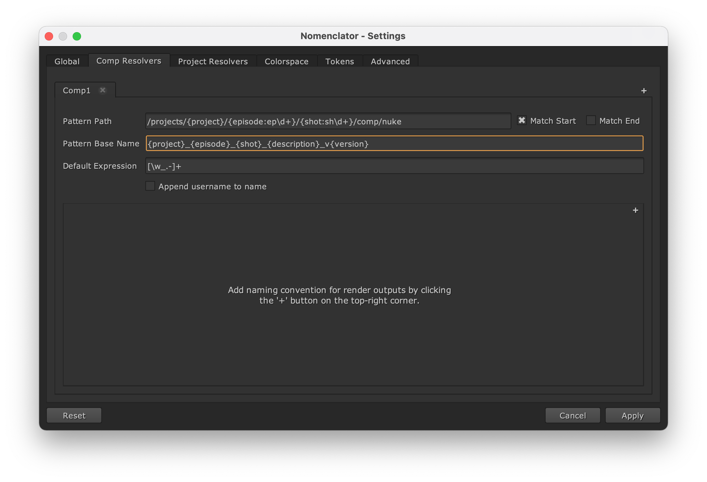
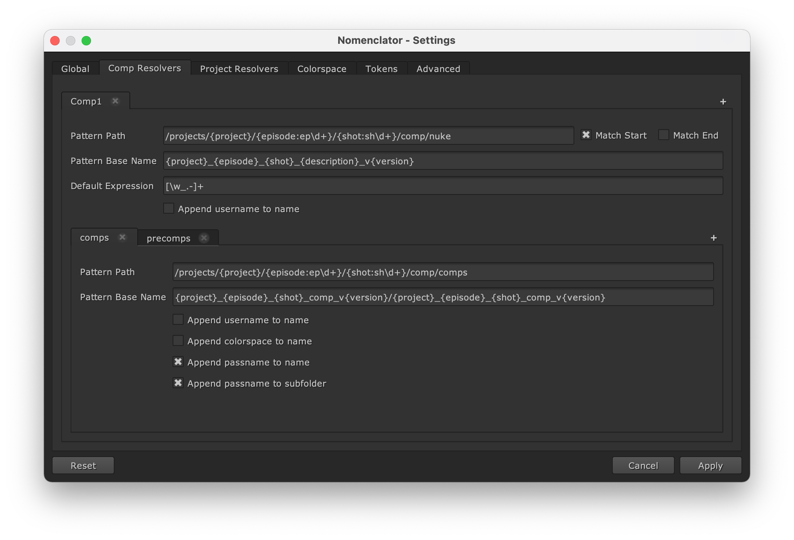

.. _tutorial:

********
Tutorial
********

In this tutorial, we will be configuring the naming convention templates for an episodic
program.

Your team is working on the next season of `Dr Who <https://en.wikipedia.org/wiki/Doctor_Who>`_,
and you are working within the following folder structure::

    /projects/
     |- drWho
         |- build
         |- edit
         |   |- hiero
         |- ep001
             |- sh001
                 |- 2D
                     |- scripts
                     |- comps
                     |- precomps

Defining the composition template
---------------------------------

The :term:`Nuke` composition scene files should be saved into the :file:`2D/scripts` folders and
be named as follows::

    {project}_{episode}_{shot}_{description}_v{version}.nk

The ``project``, ``episode`` and ``shot`` tokens should be guessed from the folder
structure. For instance, let's consider the following location::

    /projects/drWho/ep001/sh001/2D/scripts

The resulting scene files should be named::

    drWho_ep001_sh001_{description}_v{version}.nk

The value for the ``description`` token can be given via the comp manager
dialog which is initiated with the :ref:`configuration/global/default-description`
option.

The value for ``version`` will be automatically set to the next version, based on the
other file saved in the same folder.

Open the Setting Dialog and click on the "Comp Resolvers" tab to create the template.

.. image:: ./image/comp-resolver-1.png
    :alt: Comp Resolver Empty

Click on the "+" button on the top-right corner to add a new template which
is automatically named "Comp1".

.. note::

    You can edit the name by double clicking on the "Comp1" tab. You would
    then be able to type a new name and click enter to apply it. We will
    keep the automatic "Comp1" name in this tutorial.

The :ref:`configuration/template/pattern-path` value should be::

    /projects/{project}/{episode}/{shot}/2D/scripts

To prevent any matching error, we can be even more specific and define
custom regular expression for the ``episode`` and ``shot`` tokens::

    /projects/{project}/{episode:ep\d+}/{shot:sh\d+}/2D/scripts

.. note::

    We can uncheck the :ref:`configuration/template/match-end` box so that the
    naming convention can be applied to scripts saved in sub-folders, for
    instance::

        /projects/drWho/ep001/sh001/2D/scripts/sub-1/sub-2

Then we can define the :ref:`configuration/template/pattern-base` value::

    {project}_{episode}_{shot}_{description}_v{version}

Defining the output templates
-----------------------------

We need to define two destinations for render outputs:

* Default compositions should be rendered in the :file:`2D/comps` folder and be
  named as follows::

    {project}_{episode}_{shot}_comp_v{version}/{project}_{episode}_{shot}_comp_v{version}.%03d.exr

* Precomps should be rendered in the :file:`2D/precomps` folder and be
  named as follows::

    {project}_{episode}_{shot}_precomp_v{version}/{project}_{episode}_{shot}_precomp_v{version}.%03d.exr

Note that we also want to create subfolders for each outputs to better organize the image
sequences.

Click twice on the "+" button located on the top-right corner of the frame below
the composition template filled up in the previous section to add a two new
output templates which will be automatically named "Output1" and "Output2".

Double click on the tab labels to rename them "comps" and "precomps".

The :ref:`configuration/output_template/pattern-path` value for
"comps" should be::

    /projects/{project}/{episode:ep\d+}/{shot:sh\d+}/2D/comps

The :ref:`configuration/output_template/pattern-path` value for
"precomps" should be::

    /projects/{project}/{episode:ep\d+}/{shot:sh\d+}/2D/precomps

The :ref:`configuration/output_template/pattern-base` value for "comps"
should be::

    {project}_{episode}_{shot}_comp_v{version}/{project}_{episode}_{shot}_comp_v{version}

And finally, the :ref:`configuration/output_template/pattern-base` value for
"precomps" should be::

    {project}_{episode}_{shot}_precomp_v{version}/{project}_{episode}_{shot}_precomp_v{version}

We will also check the "append passname to name" and "append passname to subfolder"
boxes for "comps" so that we can automatically add passname to the subfolder
and the base name.

Saving the configuration
------------------------

Apply to automatically save the new configuration into :file:`~/.nuke/nomenclator.toml`.

.. note::

    You could save the configuration into another location by using the
    :envvar:`NOMENCLATOR_CONFIG_PATH` environment variable.

This is how the configuration saved should look like:

.. include:: ../resource/configuration-example.toml
    :code: toml

.. note::

    You can directly edit the :term:`TOML` configuration and send it to
    a team member to share it.

Managing the composition
------------------------

Now you can open a new :term:`Nuke` script and create two Write nodes.

.. image:: ./image/unsaved-comp.png
    :alt: Unsaved Comp

Open the Comp Manager Dialog and browse to::

    /projects/my_project/ep002/sh003/2D/scripts/

You can see that the names are automatically generated following the naming conventions
defined in the previous sections.

.. image:: ./image/comp-manager-1.png
    :alt: Comp Manager

Change the destination of the "Write2" node to "precomps" and save the
script by clicking on "Apply". You can now see that the name files have been
updated:

